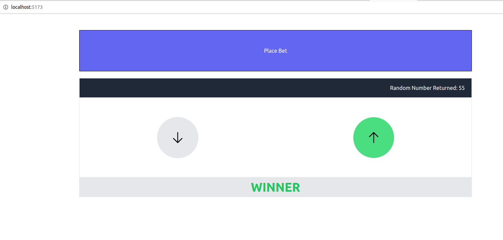

# Creating a simple betbox application using React

The final app looks like the following:

## Dependencies
1. node.js
2. npm
3. yarn

## VSCode extenstions used are:
* Auto close tag
* Auto rename tag
* ES7 React/redux snippets
* Tailwind CSS intellisense

For detailed explanation of each step in building this app, refer "React crash course" section of the Udemy course [1]

# Reference
1. [ChatGPT AI Voice Chatbot Build with React and FAST API Combo](https://www.udemy.com/course/chatgpt-ai-voice-chatbot-build-with-react-and-fast-api-combo/)
